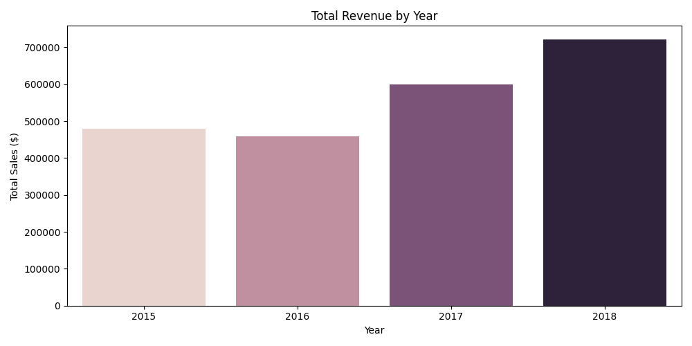
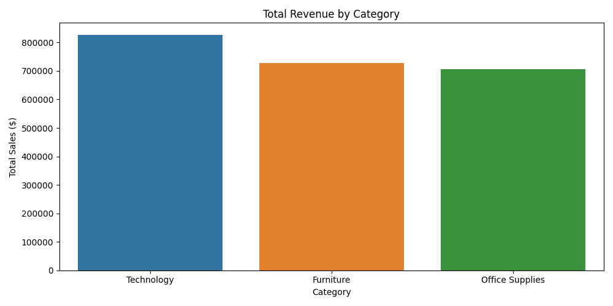
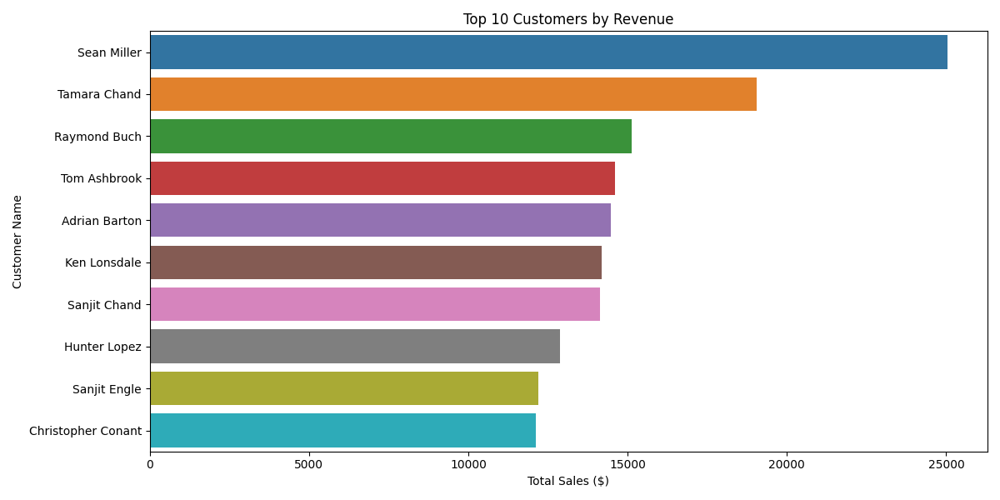
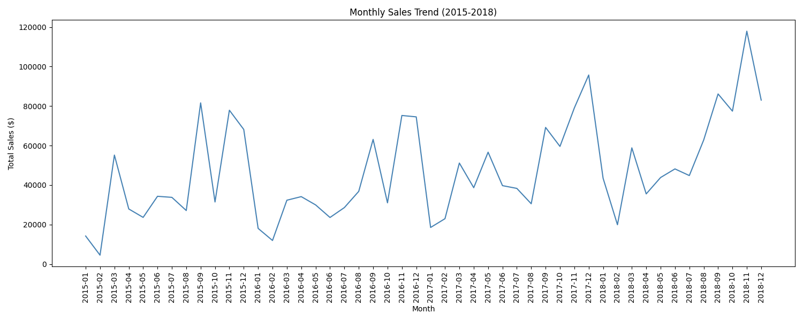
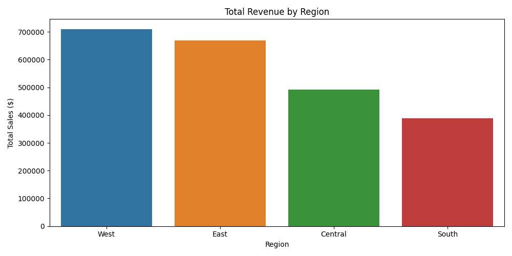
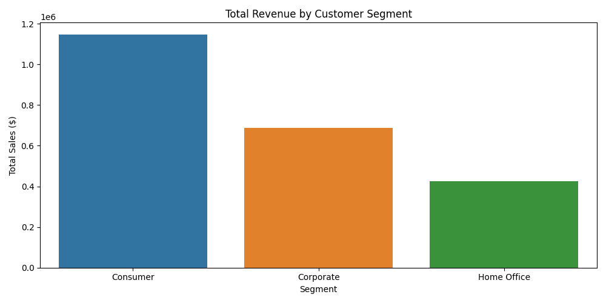

# Customer Revenue & Retention Analysis

## Project Overview
This project analyzes 4 years of retail sales data (2015-2018) to uncover revenue trends, top customers, and regional performance using Python.

## Tools Used
- Python 3.12
- Pandas
- Matplotlib
- Seaborn
- Jupyter Notebook

## Dataset
- 9,800 rows of retail transaction data
- Columns include: Order Date, Customer Name, Segment, Region, Category, Sales

## Key Analyses
1. Total Revenue by Year
2. Revenue by Product Category
3. Top 10 Customers by Revenue
4. Monthly Sales Trend (2015-2018)
5. Revenue by Region
6. Revenue by Customer Segment

## Key Findings
- Sales grew consistently from 2015 to 2018
- Technology is the highest revenue generating category
- The West region leads in total sales
- Consumer segment accounts for the largest share of revenue

## Charts

